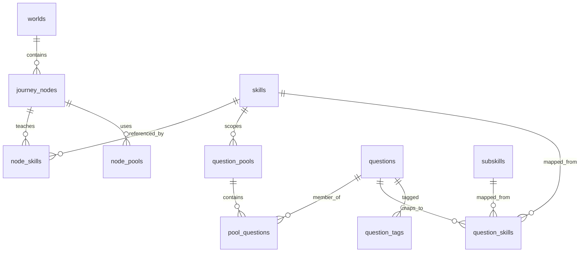

# Content Model Proposal — World → Node → Skill → Pool → Question

**Date:** 2026-06-09  
**Status:** Design only — do not implement  
**Reference:** `.ai/CONTENT_SYSTEM.md`, `.ai/ARCHITECTURE.md`, `.ai/EXECUTION.md` (A2, A3)

---

## 1. Purpose

Define the target content architecture that decouples **progression structure** from **question inventory**, enabling scalable content expansion without journey rewrites.

---

## 2. Target Hierarchy

```
World
  └── Node (progression milestone)
        └── Skill (learning unit)
              └── Question Pool (curated set)
                    └── Question (assessment item)
                          └── Question Variant (optional, Phase B+)
```

**Data flow after answer:**

```
Question → Skill Mastery → Company Readiness → Overall Readiness
```

---

## 3. Entity Definitions

### World

A themed progression destination (not a category).

| Field | Type | Description |
|-------|------|-------------|
| `id` | UUID | |
| `slug` | TEXT | Unique, URL-safe |
| `title` | TEXT | Display name |
| `description` | TEXT | Narrative blurb |
| `sort_order` | INT | Global world sequence |
| `unlock_rule` | JSONB | e.g., `{ "type": "world_complete", "world_slug": "foundation-forest" }` |
| `status` | ENUM | `draft`, `published`, `archived` |

**Examples:** Foundation Forest, System Design City, Google Mountain

---

### Node

A milestone within a world. References skills and pools — **never individual questions**.

| Field | Type | Description |
|-------|------|-------------|
| `id` | UUID | |
| `world_id` | UUID FK | |
| `slug` | TEXT | Unique within world |
| `label` | TEXT | Display name |
| `node_type` | ENUM | `lesson`, `practice`, `boss`, `review`, `checkpoint` |
| `sort_order` | INT | Order within world |
| `unlock_rule` | JSONB | e.g., `{ "type": "node_complete", "node_slug": "arrays-basics" }` |
| `mastery_threshold` | INT | Min skill mastery to complete (0–100) |
| `status` | ENUM | `draft`, `published` |

**Junction tables:**
- `node_skills(node_id, skill_id, is_primary)`
- `node_pools(node_id, pool_id, selection_strategy)` — see pools below

---

### Skill

Defined in `SKILL_GRAPH_PROPOSAL.md`. Content model references skills by ID.

---

### Question Pool

A curated, reusable set of questions scoped to a skill context.

| Field | Type | Description |
|-------|------|-------------|
| `id` | UUID | |
| `slug` | TEXT | Globally unique |
| `name` | TEXT | |
| `skill_id` | UUID FK | Primary skill |
| `subskill_id` | UUID FK nullable | Optional subskill focus |
| `difficulty_min` | TEXT | `easy`, `medium`, `hard` |
| `difficulty_max` | TEXT | Allows bands e.g., easy–medium |
| `min_questions` | INT | Coverage alert threshold |
| `status` | ENUM | `draft`, `published`, `archived` |

**Junction:** `pool_questions(pool_id, question_id, sort_order, weight)`

**Selection strategies** (on `node_pools.selection_strategy`):

| Strategy | Behavior |
|----------|----------|
| `sequential` | Next unseen question in sort_order |
| `random_unseen` | Random from unseen in pool |
| `adaptive` | Pick by lowest subskill mastery (Phase C) |
| `boss_mixed` | N questions from multiple linked pools |

---

### Question

Extended from current schema.

| Field | Type | New? | Description |
|-------|------|------|-------------|
| `id` | UUID | | |
| `body` | TEXT | | Question text |
| `round_type` | TEXT | | Legacy; maps to evaluation_type |
| `difficulty` | TEXT | | easy, medium, hard |
| `evaluation_type` | TEXT | **New** | `multiple_choice`, `coding`, `system_design`, `behavioral` |
| `answer_guide` | TEXT | | Evaluator rubric (internal) |
| `explanation` | TEXT | **New** | User-facing post-answer |
| `hints` | JSONB | **New** | `[{"order": 1, "text": "..."}]` |
| `solution` | TEXT | **New** | Canonical solution |
| `readiness_weight` | NUMERIC | **New** | 0.5–2.0, default 1.0 |
| `estimated_minutes` | INT | **New** | Expected completion time |
| `status` | TEXT | | `draft`, `pending`, `approved`, `retired` |
| `is_weekend` | BOOL | | |
| `source` | TEXT | | manual, ai_generated |
| `variant_group_id` | UUID | **New nullable** | Links variants (Phase B+) |

**Junction:** `question_tags(question_id, company)` — unchanged  
**Junction:** `question_skills` — per skill graph proposal

---

### Question Variant (Phase B+)

| Field | Type | Description |
|-------|------|-------------|
| `variant_group_id` | UUID | Shared concept ID |
| `variant_label` | TEXT | A, B, C |
| Questions share skill mapping via group defaults |

Defer implementation until Phase B content expansion.

---

## 4. Relationship Diagram



---

## 5. Complete Database Schema Proposal

### New Tables

```sql
-- Question pools
CREATE TABLE question_pools (
    id              UUID PRIMARY KEY DEFAULT gen_random_uuid(),
    slug            TEXT NOT NULL UNIQUE,
    name            TEXT NOT NULL,
    skill_id        UUID NOT NULL REFERENCES skills(id),
    subskill_id     UUID REFERENCES subskills(id),
    difficulty_min  TEXT NOT NULL DEFAULT 'easy',
    difficulty_max  TEXT NOT NULL DEFAULT 'hard',
    min_questions   INT NOT NULL DEFAULT 3,
    status          TEXT NOT NULL DEFAULT 'draft',
    created_at      TIMESTAMPTZ NOT NULL DEFAULT now(),
    updated_at      TIMESTAMPTZ NOT NULL DEFAULT now()
);

CREATE TABLE pool_questions (
    pool_id      UUID NOT NULL REFERENCES question_pools(id) ON DELETE CASCADE,
    question_id  UUID NOT NULL REFERENCES questions(id) ON DELETE CASCADE,
    sort_order   INT NOT NULL DEFAULT 0,
    PRIMARY KEY (pool_id, question_id)
);

-- Node bindings
CREATE TABLE node_skills (
    node_id     UUID NOT NULL REFERENCES journey_nodes(id) ON DELETE CASCADE,
    skill_id    UUID NOT NULL REFERENCES skills(id),
    is_primary  BOOLEAN NOT NULL DEFAULT true,
    PRIMARY KEY (node_id, skill_id)
);

CREATE TABLE node_pools (
    node_id              UUID NOT NULL REFERENCES journey_nodes(id) ON DELETE CASCADE,
    pool_id              UUID NOT NULL REFERENCES question_pools(id),
    selection_strategy   TEXT NOT NULL DEFAULT 'random_unseen',
    questions_required   INT NOT NULL DEFAULT 1,
    PRIMARY KEY (node_id, pool_id)
);

-- User pool progress (which questions seen in pool context)
CREATE TABLE user_pool_progress (
    user_id      UUID NOT NULL REFERENCES users(id) ON DELETE CASCADE,
    pool_id      UUID NOT NULL REFERENCES question_pools(id),
    question_id  UUID NOT NULL REFERENCES questions(id),
    answered_at  TIMESTAMPTZ NOT NULL DEFAULT now(),
    PRIMARY KEY (user_id, pool_id, question_id)
);
```

### Alter Existing Tables

```sql
-- questions: add columns (all nullable initially)
ALTER TABLE questions
    ADD COLUMN evaluation_type TEXT,
    ADD COLUMN explanation TEXT,
    ADD COLUMN hints JSONB DEFAULT '[]',
    ADD COLUMN solution TEXT,
    ADD COLUMN readiness_weight NUMERIC(3,2) DEFAULT 1.0,
    ADD COLUMN estimated_minutes INT DEFAULT 10,
    ADD COLUMN variant_group_id UUID;

-- worlds: add unlock/status
ALTER TABLE worlds
    ADD COLUMN unlock_rule JSONB,
    ADD COLUMN status TEXT NOT NULL DEFAULT 'published';

-- journey_nodes: add slug, unlock, threshold
ALTER TABLE journey_nodes
    ADD COLUMN slug TEXT,
    ADD COLUMN unlock_rule JSONB,
    ADD COLUMN mastery_threshold INT DEFAULT 70,
    ADD COLUMN status TEXT NOT NULL DEFAULT 'published';

-- Expand node_type check to include practice, review, checkpoint
```

### Tables to Deprecate (Not Drop in Phase A)

| Table | Fate |
|-------|------|
| `daily_papers` | Keep for "Quick Play" until journey selection stable |
| `daily_paper_questions` | Same |

---

## 6. Content Selection Flow (Target)

### Journey Mode

```
1. User taps node N
2. Journey service loads node_pools + node_skills
3. For each required question:
   a. PoolSelector picks from pool using strategy + user_pool_progress
   b. Filter: approved status, not retired
   c. Optional: filter by user difficulty band
4. Return question(s) to client
5. On submit → evaluate → update skill mastery → check mastery_threshold
6. If threshold met → mark node complete → evaluate unlock_rule for next nodes
```

### Quick Play Mode (Legacy Daily Paper — Transitional)

```
1. Select from pools across user's current world active skills
2. Not index-based; pool-aware selection
3. Eventually merge into journey "practice" nodes
```

---

## 7. Migration Plan from Current Implementation

### Stage 0 — Baseline (Today)

- Questions in `questions` + `question_tags`
- Daily paper selects by difficulty + random
- Journey maps nodes to daily paper index

### Stage 1 — Schema Additive (A1 + A3)

| Action | Breaking? |
|--------|-----------|
| Create skills, subskills, question_skills | No |
| Add nullable columns to questions | No |
| Seed skill graph | No |

### Stage 2 — Pools + Node Bindings (A2)

| Action | Breaking? |
|--------|-----------|
| Create question_pools, pool_questions | No |
| Create node_skills, node_pools | No |
| Backfill Foundation Forest node → pool mappings | No |
| Create 3–5 pools with existing 12 seed questions | No |

### Stage 3 — Parallel Selection Path

| Action | Breaking? |
|--------|-----------|
| New endpoint: `GET /journey/nodes/{id}/question` | No |
| Feature flag `JOURNEY_POOL_SELECTION=true` | No |
| Old daily paper path remains default | No |

### Stage 4 — Journey Unlock V2

| Action | Breaking? |
|--------|-----------|
| Unlock from user_journey_progress + skill mastery | UX change |
| Stop index mapping in GetJourney | Flag-gated |
| GET journey becomes read-only (no side effects) | No |

### Stage 5 — Readiness Integration (A4)

| Action | Breaking? |
|--------|-----------|
| Skill mastery drives node completion | UX change |
| Readiness uses skill scores | Numbers change |

### Stage 6 — Content Management (A5)

| Action | Breaking? |
|--------|-----------|
| Internal APIs for pools, nodes, questions | No |
| Stop adding content via migrations | Process change |

### Stage 7 — Daily Paper Deprecation (Post Phase A)

| Action | Breaking? |
|--------|-----------|
| Redirect daily paper to journey practice nodes | Yes — plan for Phase B |

---

## 8. Backward Compatibility Concerns

### BC1 — Existing API Contracts

| Endpoint | Risk | Mitigation |
|----------|------|------------|
| `GET /questions/daily` | Still used by Play tab | Keep until clients migrate |
| `GET /journey` | Response shape adds fields | Additive JSON fields only |
| `POST /questions/{id}/submit` | Adds skill deltas to response | Additive fields |

### BC2 — Existing User Progress

- `user_question_history` remains valid — backfill skill mastery from history
- `user_journey_progress` may reset when switching to mastery-based unlock — **communicate one-time migration**
- Streak logic unchanged (still one answer per day)

### BC3 — Seed Question IDs

- Fixed UUIDs in migrations (`b0000000-...`) preserved
- pool_questions references same IDs

### BC4 — round_type Column

- Keep for backward compatibility through Phase B
- New code uses `evaluation_type`; sync via migration:
  - `dsa` → `coding`
  - `system_design` → `system_design`
  - `behavioral` → `behavioral`
  - etc.

### BC5 — Mobile/Web Clients

- Clients ignoring new fields continue to work
- Journey UI should handle nodes without `question_id` until pool selection shipped
- Coordinate client updates with Stage 3 flag

### BC6 — Kafka Events

- Extend `question.answered` with optional `skill_deltas[]` — old consumers ignore
- Add new events without removing old ones

---

## 9. Content Lifecycle (Target)

```
draft → pending (review) → approved (published) → retired
```

| Status | Visible in pools? | Selectable? |
|--------|-------------------|-------------|
| draft | No | No |
| pending | No | No |
| approved | Yes | Yes |
| retired | Removed from new selections | No |

AI-generated questions enter at `pending` — no auto-promote (per AGENTS.md).

---

## 10. Mapping Current Seed Content

### Existing Questions → Proposed Pools

| Question (short) | Pool | Skill |
|------------------|------|-------|
| Two Sum variant | `foundation-arrays-easy` | arrays |
| LRU Cache | `foundation-hash-maps-medium` | hash-maps |
| Tree traversal | `foundation-trees-medium` | trees |
| Rate limiter | `system-design-fundamentals-hard` | system-design |
| Behavioral STAR | `behavioral-star-medium` | behavioral |

### Foundation Forest Nodes → Pools

| Node | Pool(s) |
|------|---------|
| Arrays Basics | `foundation-arrays-easy` |
| String Patterns | `foundation-strings-easy` |
| Hash Maps | `foundation-hash-maps-easy` |
| Tree Traversal | `foundation-trees-medium` |
| Forest Boss | `foundation-arrays-medium`, `foundation-hash-maps-medium`, `foundation-trees-medium` (boss_mixed) |

---

## 11. API Surface (Content + Journey)

| Method | Path | Description |
|--------|------|-------------|
| GET | `/journey` | Worlds + nodes + status (no question IDs initially) |
| GET | `/journey/nodes/{id}` | Node detail + skills |
| GET | `/journey/nodes/{id}/question` | Select question from bound pools |
| POST | `/journey/nodes/{id}/complete` | Explicit completion (if threshold met) |
| GET | `/content/pools/{slug}` | Pool metadata (internal) |
| POST | `/internal/content/questions` | Create question (A5) |
| POST | `/internal/content/pools/{id}/questions` | Add to pool (A5) |

---

## 12. What Not to Do in Phase A

- Do not drop `daily_papers` tables
- Do not require all worlds/skills to have content
- Do not implement question variants
- Do not implement adaptive pool selection
- Do not split into separate microservices until package boundaries are stable

---

## 13. Success Criteria (from EXECUTION.md A2 + A3)

- [ ] Nodes reference skills via `node_skills`, not question IDs
- [ ] Nodes reference pools via `node_pools`
- [ ] Questions have skill, subskill, readiness_weight, explanation, hints
- [ ] Approved questions must belong to ≥1 pool
- [ ] Journey can serve a question from a pool without daily paper

---

*Design document only. No implementation.*
