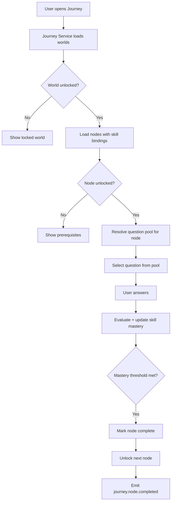

# Journey Audit — Prepio vs Target Model

**Date:** 2026-06-09  
**Reference:** `.ai/CONTENT_SYSTEM.md`, `.ai/ARCHITECTURE.md`, `.ai/EXECUTION.md` (A2)

---

## Executive Summary

Journey exists as a **UI-facing API** backed by database tables, but progression is **not journey-driven**. The implementation maps journey node labels to **daily paper question array indices**, making the journey a visual wrapper over the existing daily challenge flow. There is **no dependency on skills**, **no question pools**, and **no meaningful unlock graph**.

---

## 1. How Journey Currently Works

### API

| Endpoint | Method | Service | Behavior |
|----------|--------|---------|----------|
| `/api/v1/journey` | GET | Question (8082) | Returns worlds with nodes, status, optional question_id |

### Data Model (`000024_create_journey.up.sql`)

**`worlds`**
- `id`, `slug`, `title`, `description`, `sort_order`
- One row seeded: `foundation-forest` / "Foundation Forest"

**`journey_nodes`**
- `id`, `world_id`, `label`, `node_type` (`lesson` | `boss`), `sort_order`
- Five nodes seeded (Arrays Basics → Forest Boss)

**`user_journey_progress`**
- `user_id`, `node_id`, `status` (`done` | `current` | `locked`), `completed_at`
- Unique on `(user_id, node_id)`

### Runtime Flow (`services/question/internal/service/journey.go`)

```
GET /journey
  │
  ├─ Load world by hardcoded slug "foundation-forest"
  ├─ Load all nodes for world (ORDER BY sort_order)
  ├─ Call GetDailyPaper(userID) → today's questions[]
  ├─ Load user's answer history for today's session
  │
  └─ For each node[i]:
       if i < len(paper.questions):
         question_id = paper.questions[i].id
         if answered → status = "done"
         else if all prior done → status = "current"
         else → status = "locked"
       else if boss and all prior done:
         status = "current" (no question_id)
       else:
         status = "locked"
       Upsert user_journey_progress if done
```

### Frontend Consumption

- Web: `web/src/components/game/JourneyMap.tsx` (or equivalent journey UI)
- Mobile: journey screen reads same API
- Dashboard may show journey summary via gateway

---

## 2. Does Journey Depend on Questions?

**Yes — but incorrectly.**

| Dependency Type | Present? | How |
|-----------------|----------|-----|
| Node → specific question pool | **No** | |
| Node → skill-matched questions | **No** | |
| Node → daily paper index | **Yes** | `paper.questions[i]` |
| Boss node → special question | **No** | Boss unlocks with no question attached |

Journey **does not select questions**. It **reflects** whatever daily paper already selected, by position.

**Consequence:** Node label "Arrays Basics" may show a behavioral or system design question if daily selection returns one at index 0.

---

## 3. Does Journey Depend on Skills?

**No.**

- `journey_nodes` has no `skill_id` column
- No skill mastery check for unlock
- No skill completion threshold
- Node status is purely **session answer order**, not learning outcomes

**Target (`.ai/CONTENT_SYSTEM.md`):**
> A node teaches or evaluates one or more skills.

**Gap:** Complete absence of skill linkage.

---

## 4. How Are Nodes Unlocked?

### Current Unlock Rules

| Node Type | Unlock Condition |
|-----------|------------------|
| Lesson node `i` | Node `i-1` has an answered question in today's daily paper |
| First node (i=0) | Always `current` if paper has ≥1 question |
| Boss node | All prior lesson nodes `done` (all daily questions answered) |

### What Does NOT Affect Unlock

- Historical progress across days
- Skill mastery
- `user_journey_progress` table (written but **not read** for unlock)
- User level or readiness
- World completion
- Gem spend / streak

### Persistence Bug / Design Issue

`user_journey_progress` is upserted during GET when a node is `done`, but unlock logic recomputes from **today's daily paper only**. Cross-day journey state is **lost** for unlock purposes.

---

## 5. How Is Progression Calculated?

### Current Model

```
Progression unit = daily paper question (by index)
Completion = submit answer for that question today
Boss completion = all 4 lesson questions answered today
```

There is **no XP tied to nodes**, **no node-specific rewards**, and **no world completion event**.

### Parallel Progression Systems

| System | Drives | Stored In |
|--------|--------|-----------|
| Daily paper | Streak, XP, gems | `daily_papers`, `user_question_history` |
| Journey overlay | Node status UI | Ephemeral + `user_journey_progress` (partial) |
| User level | Question difficulty band | Progress service |

These systems are **not unified**.

---

## 6. Comparison — Target Hierarchy

```
Target:  World → Node → Skill → Question Pool → Question
Current: World → Node (label only) → daily_paper.questions[index]
```

### Layer-by-Layer Gap Analysis

| Layer | Target | Current | Gap |
|-------|--------|---------|-----|
| **World** | Multiple worlds, unlock rules, narrative | 1 world hardcoded slug | No multi-world, no unlock rules |
| **Node** | Teaches/evaluates skills, pool reference | Label + sort_order only | No skill_id, no pool_id |
| **Skill** | Mastery tracked, drives readiness | Does not exist | Full layer missing |
| **Question Pool** | Curated set per skill/difficulty | Does not exist | Full layer missing |
| **Question** | Maps to skills, selected from pool | Random daily selection | No pool selection |

---

## 7. Detailed Gap Register

| ID | Gap | Severity | Target Behavior |
|----|-----|----------|-----------------|
| J1 | Index-based question mapping | **Critical** | Node selects from bound pool filtered by skill |
| J2 | Hardcoded `foundation-forest` | **High** | Load worlds by user progression / unlock |
| J3 | No skill on node | **Critical** | `journey_nodes.skill_ids[]` or junction table |
| J4 | No question pools | **Critical** | `node_pools` or derive pool from skill |
| J5 | Daily paper coupling | **Critical** | Journey drives question selection, not reverse |
| J6 | user_journey_progress unused for reads | **High** | Source of truth for cross-session progress |
| J7 | Boss node has no question | **Medium** | Boss pulls from hard/mixed pool or multi-question set |
| J8 | No world completion | **Medium** | Emit `world.completed` when all nodes done |
| J9 | No journey events | **High** | `journey.node.completed`, `world.completed` to Kafka |
| J10 | GET with side effects | **Medium** | Progress writes on read path |
| J11 | No weekend/weekday journey variance | **Low** | Weekend nodes may use system design pools |
| J12 | Node types underused | **Low** | `lesson`, `boss`, `checkpoint`, `review` per CONTENT_SYSTEM |

---

## 8. Journey Node Types — Target vs Current

| Type | Target Purpose | Current |
|------|----------------|---------|
| `lesson` | Introduce skill via pool | Label only |
| `practice` | Reinforce skill | Not used |
| `boss` | Multi-skill check | Unlock gate only, no question |
| `review` | Spaced repetition | Not used |
| `checkpoint` | Readiness assessment | Not used |

Current schema allows `lesson` and `boss` only.

---

## 9. Intended Journey Flow (Target)



---

## 10. Migration Path Summary

| Step | Action | Breaking? |
|------|--------|-----------|
| 1 | Add `skill_id` / `pool_id` to `journey_nodes` | No (nullable) |
| 2 | Create pools per Foundation Forest skill | No |
| 3 | Backfill node → pool mappings | No |
| 4 | New API: `GET /journey/nodes/{id}/question` selects from pool | No (additive) |
| 5 | Journey service computes unlock from `user_journey_progress` + skill mastery | UX change |
| 6 | Deprecate index mapping in `GetJourney` | Flag-gated |
| 7 | Daily paper becomes separate "Quick Play" mode | Product decision |

---

## 11. Answers to Audit Questions (Checklist)

| Question | Answer |
|----------|--------|
| How does journey currently work? | GET API overlays node labels on daily paper questions by index |
| Does journey depend on questions? | Yes, via daily paper index — not via pools |
| Does journey depend on skills? | **No** |
| How are nodes unlocked? | Previous node answered in **today's** session |
| How is progression calculated? | Daily paper answer count; not skill-based |
| World → Node → Skill → Pool → Question | Only World → Node (partial) exists |

---

*This document is analysis only. No code was modified.*
