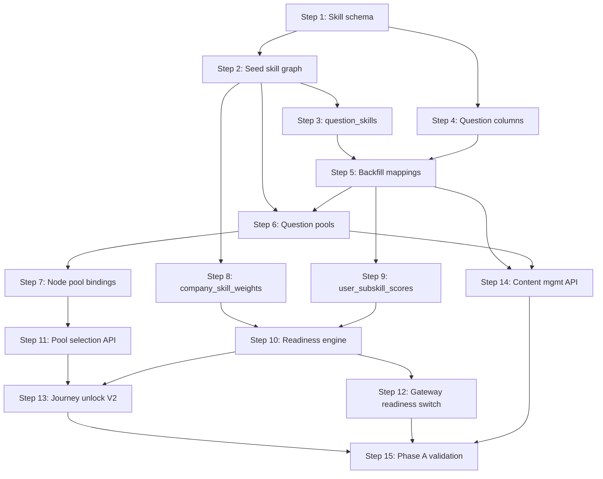

# Phase A Implementation Plan

**Date:** 2026-06-09  
**Status:** Planning only — no implementation  
**Reference:** `.ai/EXECUTION.md`, `.ai/ARCHITECTURE.md`, `.ai/CONTENT_SYSTEM.md`, `.ai/PRODUCT.md`

**Related audit documents:**
- `CONTENT_AUDIT.md`
- `DOMAIN_AUDIT.md`
- `JOURNEY_AUDIT.md`
- `READINESS_AUDIT.md`
- `SKILL_GRAPH_PROPOSAL.md`
- `CONTENT_MODEL_PROPOSAL.md`

---

## 1. Goals

Phase A builds foundational systems **correctly** so Phase B can add 100–150 questions without architectural rewrites.

**Phase A success criteria (from EXECUTION.md):**

- ✓ Skill graph exists
- ✓ Question schema upgraded
- ✓ Readiness V2 works
- ✓ Content architecture works (World → Node → Skill → Pool → Question)
- ✓ Content management foundation exists

**Constraints for this plan:**

- Small, safe steps
- No breaking migrations
- Preserve existing functionality (daily paper, streaks, XP, current journey API)
- Avoid full rewrites — extract and extend
- Feature flags for behavioral changes

---

## 2. Dependency Graph

---

## 3. Implementation Steps

---

### Step 1 — Create skill graph schema

**Task:** A1 (partial)  
**Depends on:** Nothing  
**Owner package:** `services/question/internal/store` or new `shared/skills`  
**Migration:** `000025_create_skill_categories_skills_subskills.up.sql`

**Actions:**
1. Create `skill_categories`, `skills`, `subskills`, `skill_prerequisites` tables
2. Add indexes on `slug` columns
3. Add `updated_at` triggers (match existing migration patterns)

**Breaking changes:** None — additive tables only

**Verification:**
- `go build ./...`
- Migration up/down on test container

---

### Step 2 — Seed skill graph

**Task:** A1  
**Depends on:** Step 1  
**Migration:** `000026_seed_skill_graph.up.sql` OR seed CLI (prefer migration for reproducibility in Phase A)

**Actions:**
1. Insert 8 categories from `SKILL_GRAPH_PROPOSAL.md`
2. Insert 28 top-level skills with prerequisites
3. Insert subskills for Foundation Forest skills (arrays, strings, hash-maps, trees)
4. Defer remaining subskills to Phase B if time-constrained — but **schema must support all**

**Breaking changes:** None

**Verification:**
- Query: every skill has a category
- Query: no prerequisite cycles

---

### Step 3 — Create question_skills junction

**Task:** A1  
**Depends on:** Step 2  
**Migration:** `000027_create_question_skills.up.sql`

**Actions:**
1. Create `question_skills(question_id, skill_id, subskill_id, weight)`
2. Add FK constraints with CASCADE on question delete

**Breaking changes:** None

---

### Step 4 — Extend questions table

**Task:** A3  
**Depends on:** Step 1 (logical, not blocking)  
**Migration:** `000028_extend_questions.up.sql`

**Actions:**
1. Add nullable columns: `evaluation_type`, `explanation`, `hints`, `solution`, `readiness_weight`, `estimated_minutes`, `variant_group_id`
2. Set defaults: `readiness_weight = 1.0`, `estimated_minutes = 10`, `hints = '[]'`
3. Backfill `evaluation_type` from `round_type` mapping

**Breaking changes:** None — all nullable/defaulted

**Verification:**
- Existing question queries unchanged
- Existing 12 seed questions still load

---

### Step 5 — Backfill question skill mappings and content metadata

**Task:** A1 + A3  
**Depends on:** Steps 3, 4  
**Migration:** `000029_backfill_question_skills.up.sql` + data fixes in `000030_enrich_seed_questions.up.sql`

**Actions:**
1. Map all 12 seed questions to skills/subskills (manual mapping table in migration)
2. Populate `explanation`, `hints`, `solution` for seed questions (split from `answer_guide` where needed)
3. Assign `readiness_weight` by difficulty (easy=0.8, medium=1.0, hard=1.2 — move to `config/readiness.go`)
4. Insert `question_skills` rows

**Breaking changes:** None

**Verification:**
- Every approved question has ≥1 `question_skills` row
- Completion criteria A1: "Every question maps to skills"

---

### Step 6 — Create question pools

**Task:** A2  
**Depends on:** Steps 2, 5  
**Migration:** `000031_create_question_pools.up.sql`

**Actions:**
1. Create `question_pools`, `pool_questions`, `user_pool_progress`
2. Seed Foundation Forest pools per `CONTENT_MODEL_PROPOSAL.md`
3. Assign seed questions to pools

**Breaking changes:** None

**Verification:**
- Each Foundation Forest skill has ≥1 pool with ≥1 question

---

### Step 7 — Bind journey nodes to skills and pools

**Task:** A2  
**Depends on:** Steps 2, 6  
**Migration:** `000032_journey_node_bindings.up.sql`

**Actions:**
1. Add `slug`, `unlock_rule`, `mastery_threshold`, `status` to `journey_nodes`
2. Create `node_skills`, `node_pools`
3. Backfill Foundation Forest node slugs and bindings
4. Remove hardcoded index logic **later** (Step 13) — schema only here

**Breaking changes:** None — existing `GetJourney` ignores new columns until Step 13

**Verification:**
- Every published node has ≥1 node_skill and ≥1 node_pool

---

### Step 8 — Create company_skill_weights

**Task:** A4 (prerequisite)  
**Depends on:** Step 2  
**Migration:** `000033_create_company_skill_weights.up.sql`

**Actions:**
1. Create `company_skill_weights(company, skill_id, weight)`
2. Seed Google, Amazon, Meta, Uber, Atlassian profiles from `SKILL_GRAPH_PROPOSAL.md`
3. Add companies from seed questions not in onboarding list (zepto, flipkart, etc.) with provisional weights

**Breaking changes:** None

**Verification:**
- Each onboarding company has weights summing to 100

---

### Step 9 — Create user_subskill_scores + Progress consumer update

**Task:** A4 (partial)  
**Depends on:** Steps 3, 5  
**Migration:** `000034_create_user_subskill_scores.up.sql`

**Actions:**
1. Create `user_subskill_scores` table
2. Add `config/readiness.go` with mastery delta constants
3. In Progress service: extend Kafka consumer to update subskill mastery on `question.answered`
4. Extend `question.answered` event payload with `skill_ids`, `subskill_ids`, `score`, `readiness_weight` (additive fields)
5. Question service: include skill mapping in event emission on submit
6. Backfill script/job: compute initial mastery from `user_question_history`

**Breaking changes:** None — shadow write only

**Verification:**
- Unit tests: answer updates subskill mastery
- Backfill completes for test users

---

### Step 10 — Implement Readiness Engine V2 in Progress service

**Task:** A4  
**Depends on:** Steps 8, 9  
**Code:** `services/progress/internal/service/readiness.go` (new)

**Actions:**
1. Implement `ComputeCompanyReadiness(userID, company)` from skill masteries × weights
2. Implement `ComputeOverallReadiness(userID)` from user_targets
3. Implement `ComputeSkillGaps(userID, company)` for explainability
4. Add APIs:
   - `GET /api/v1/progress/readiness`
   - `GET /api/v1/progress/readiness/skills`
   - `GET /api/v1/progress/readiness/{company}/gaps`
5. Emit `readiness.updated` Kafka event when delta ≥ threshold
6. Optional cache tables: `user_company_readiness` (Step 10b migration if needed)

**Breaking changes:** None — new endpoints only

**Verification:**
- Unit tests with fixture skill scores + weights
- Integration test: submit answer → mastery update → readiness changes

---

### Step 11 — Pool-based question selection API

**Task:** A2  
**Depends on:** Steps 6, 7  
**Code:** `services/question/internal/service/pool_selector.go` (new)

**Actions:**
1. Implement `SelectFromPool(userID, poolID, strategy)` — respects `user_pool_progress`, approved status
2. Wire target companies into selection weighting (fix D11 from DOMAIN_AUDIT)
3. Add endpoint: `GET /api/v1/journey/nodes/{id}/question`
4. Register route in gateway
5. Feature flag: `JOURNEY_POOL_SELECTION` — default `false`

**Breaking changes:** None — additive endpoint

**Verification:**
- Node returns question from bound pool, not daily paper index
- Unseen preference works

---

### Step 12 — Switch dashboard readiness to Progress API

**Task:** A4  
**Depends on:** Step 10  
**Code:** `services/gateway/internal/dashboard/service.go`

**Actions:**
1. Replace `computeReadiness()` with call to Progress `GET /progress/readiness`
2. Feature flag: `READINESS_V2` — default `false` initially, then `true`
3. Update submit response `readiness_delta` to use Progress overall delta (Question service calls Progress internal API or computes from shared formula lib)
4. Deprecate but keep `GET /questions/stats/readiness` during transition

**Breaking changes:** Readiness numbers change when flag enabled — **not a schema break**

**Verification:**
- Dashboard shows per-company + overall from new API
- Submit delta matches dashboard formula

---

### Step 13 — Journey unlock V2 and remove index hack

**Task:** A2  
**Depends on:** Steps 7, 9, 10, 11  
**Code:** `services/question/internal/service/journey.go`

**Actions:**
1. Read `user_journey_progress` for cross-session state
2. Unlock rules: previous node complete OR mastery threshold met
3. Node complete: mastery ≥ `mastery_threshold` for primary skill(s)
4. Remove daily paper index mapping when `JOURNEY_V2=true`
5. Remove side effects from GET — write progress on `question.completed` event consumed by Journey module
6. Emit `journey.node.completed` event
7. Load worlds dynamically (remove `foundationWorldSlug` hardcode — query published worlds)

**Breaking changes:** UX — node status may differ; gated by flag

**Verification:**
- Integration test: complete node via pool questions → next unlocks
- Boss node serves mixed pool questions

---

### Step 14 — Content management foundation

**Task:** A5  
**Depends on:** Steps 1–7, 5  
**Code:** `services/question/internal/handler/internal_content.go` (new)

**Actions:**
1. Internal auth middleware (API key or admin JWT claim)
2. CRUD endpoints:
   - Skills / subskills (read-only public, write internal)
   - Questions create/update (status workflow: draft → pending → approved)
   - Pools create + assign questions
   - Nodes create + bind skills/pools
3. Validation: approved questions require skill mapping, explanation, hints, solution
4. JSON export/import for bulk content ops
5. CLI wrapper: `cmd/content/main.go` calling internal APIs

**Breaking changes:** None — internal only

**Verification:**
- Create question via API → approve → appears in pool selection
- No new question INSERT migrations after this step

---

### Step 15 — Phase A validation and documentation

**Task:** All  
**Depends on:** Steps 1–14

**Actions:**
1. Run full checklist from EXECUTION.md Phase A success criteria
2. Update `AGENTS.md` with 6-domain model and new ownership rules
3. Add integration tests:
   - Skill mapping on all approved questions
   - Pool selection from journey node
   - Readiness explainability API
   - Journey node unlock across sessions
4. Run `go test ./...`, `go vet ./...`
5. Manual QA: web + mobile journey with `JOURNEY_V2` and `READINESS_V2` enabled
6. Document feature flags in `EXECUTION.md` or runbook

**Breaking changes:** None

---

## 4. Feature Flags Summary

| Flag | Default | Enables |
|------|---------|---------|
| `JOURNEY_POOL_SELECTION` | `false` | `GET /journey/nodes/{id}/question` from pools |
| `JOURNEY_V2` | `false` | Mastery-based unlock, no index hack |
| `READINESS_V2` | `false` | Progress-owned readiness in dashboard |

**Rollout order:** Pool selection → Readiness V2 → Journey V2

---

## 5. Migration Numbering Plan

| Migration | Content |
|-----------|---------|
| 000025 | skill_categories, skills, subskills, skill_prerequisites |
| 000026 | seed skill graph |
| 000027 | question_skills |
| 000028 | extend questions columns |
| 000029 | backfill question_skills |
| 000030 | enrich seed question metadata |
| 000031 | question_pools, pool_questions, user_pool_progress |
| 000032 | node_skills, node_pools, journey_nodes extensions |
| 000033 | company_skill_weights + seed |
| 000034 | user_subskill_scores |

Optional 000035+: readiness cache tables

**Rule:** Never edit applied migrations. Always new files.

---

## 6. Package / Service Refactor (Non-Breaking)

Parallel to steps above, reorganize code without splitting binaries:

| Step | Refactor |
|------|----------|
| With Step 10 | Move readiness out of gateway into progress |
| With Step 13 | Extract `journey` package from question service |
| With Step 14 | Extract `content` handler group |
| Post A | Consider `shared/evaluation` for evaluator |

Defer separate microservices until Phase B/C unless operational need arises.

---

## 7. Client Update Sequence

| Client | When | Changes |
|--------|------|---------|
| Web | After Step 11 | Call `/journey/nodes/{id}/question` when flag on |
| Web | After Step 12 | Read skill deltas from submit response; readiness breakdown UI |
| Mobile | After Step 11 | Same as web |
| Both | After Step 13 | Handle new journey unlock states |

Clients must tolerate additive API fields throughout.

---

## 8. Risk Register

| Risk | Mitigation |
|------|------------|
| Readiness numbers confuse users | Feature flag; in-app explainer before enabling V2 |
| Journey regression | Keep daily paper; parallel paths until V2 validated |
| Double XP award | Audit Step 9 — single award path via Progress Kafka |
| Incomplete skill backfill | Block `approved` status without question_skills in CMS validation |
| Migration sprawl | 10 migrations acceptable for Phase A; batch small DDL where safe |

---

## 9. What Phase A Explicitly Does NOT Include

- Phase B content expansion (100–150 questions)
- Question variants
- Companion evolution (Phase C)
- Daily quests (Phase C)
- Adaptive pool selection
- Voice/architecture evaluation types
- Dropping daily_papers tables
- Splitting into 6 microservices

---

## 10. Estimated Sequence Timeline

Assuming one engineer, focused execution:

| Steps | Effort | Cumulative |
|-------|--------|------------|
| 1–2 | 2 days | Skill foundation |
| 3–5 | 3 days | Question upgrade + backfill |
| 6–7 | 2 days | Pools + node bindings |
| 8–10 | 4 days | Readiness V2 |
| 11–13 | 4 days | Journey decoupling |
| 14 | 3 days | Content CMS |
| 15 | 2 days | Validation |

**Total:** ~20 working days

Parallelizable: Steps 8–9 with 6–7; Step 14 with 11–13.

---

## 11. Definition of Done — Phase A

Before unlocking Phase B:

- [ ] All 15 steps complete
- [ ] Feature flags documented and tested
- [ ] Every approved question has skill + subskill + pool membership
- [ ] Foundation Forest journey works end-to-end via pools (flag on)
- [ ] Readiness API returns explainable skill breakdown (flag on)
- [ ] Content creatable via internal API without migration
- [ ] `go build`, `go test`, `go vet` clean
- [ ] AGENTS.md updated
- [ ] Audit documents reviewed and signed off by team

---

*Planning document only. No code, migrations, or schemas were created.*
